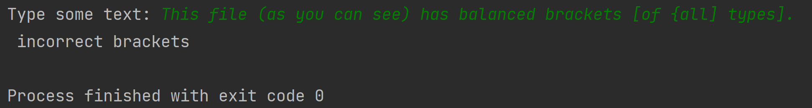
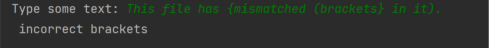

<h1>Array and Linked List based Stack Practice</h1>

<h2>Problem Description</h2>
Project consists of creating bracket matching function with two different methods. The first method makes use of an Array based Stack while the second method makes use of a Linked List based stack. The first task was to complete the Linked List implementation by completing the data structure definition, then complete the implementation of a stack_free function to make sure that when the stack is no longer needed, it is properly destructed and allocations are freed. Finally, implementation of the push and pop functions were completed to add and remove elements from the stack. The second task included implementing functionality of a push and pop function to be used for the array based stack. The third and final task included completing a function to take input from user text, and correctly identify if the brackets enetred were correctly positioned.
 

<h2>Languages and Utilities Used</h2>

- <b>C</b> 

<h2>Environments Used </h2>

- <b>Windows 11</b>
- <b>C Lion</b>

<h2>Program sample output:</h2>

Correct Bracket Output:

  

Mismatched Bracket Output:

  

Missing Bracket Output:

  

